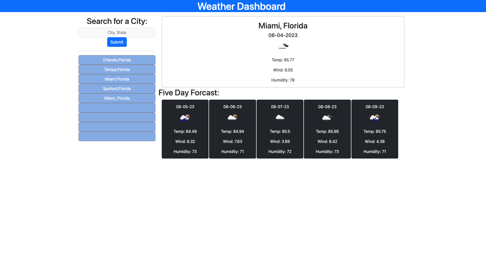

# Weather Application

## Table of Contents
- [Requerments](#requierments)
- [Features](#features)
- [Link to live site](#link-to-live-site)
- [Screenshots](#screenshots)
- [Credits](#credits)
- [License](#license)

## Requierments

AS A traveler
I WANT to see the weather outlook for multiple cities
SO THAT I can plan a trip accordingly

GIVEN a weather dashboard with form inputs
WHEN I search for a city
THEN I am presented with current and future conditions for that city and that city is added to the search history
WHEN I view current weather conditions for that city
THEN I am presented with the city name, the date, an icon representation of weather conditions, the temperature, the humidity, and the the wind speed
WHEN I view future weather conditions for that city
THEN I am presented with a 5-day forecast that displays the date, an icon representation of weather conditions, the temperature, the wind speed, and the humidity
WHEN I click on a city in the search history
THEN I am again presented with current and future conditions for that city

You will use localStorage to store any persistent data. For more information on how to work with the OpenWeather API, refer to the Full-Stack Blog on how to use API keysLinks to an external site..

## Features
This application has the following based on requierments
- Search input field to submit a location.  Search has regex to assist with entrey to get best results.
- Localstorage is used to store 9 searches.  These are loaded at page start if they exist
- History is clickable and searchs for the city as needed
- Daily forcast display required information and icon
- 5 day forcast display weather for each day with date and icons.
- catch is used to stop invalid inputs and requests the user to update search request

The following was used from the class materials
- fetch
- input form
- loops
- click events
- localstorage
- error handling
- api requests

## Link to live site

https://shutterspeed1000.github.io/weatherApp/

## Screenshots

## Credits

https://openweathermap.org/forecast5 API used in application

## License

Copyright (c) 2023 Sean Worrell

Permission is hereby granted, free of charge, to any person obtaining a copy
of this software and associated documentation files (the "Software"), to deal
in the Software without restriction, including without limitation the rights
to use, copy, modify, merge, publish, distribute, sublicense, and/or sell
copies of the Software, and to permit persons to whom the Software is
furnished to do so, subject to the following conditions:

The above copyright notice and this permission notice shall be included in all
copies or substantial portions of the Software.

THE SOFTWARE IS PROVIDED "AS IS", WITHOUT WARRANTY OF ANY KIND, EXPRESS OR
IMPLIED, INCLUDING BUT NOT LIMITED TO THE WARRANTIES OF MERCHANTABILITY,
FITNESS FOR A PARTICULAR PURPOSE AND NONINFRINGEMENT. IN NO EVENT SHALL THE
AUTHORS OR COPYRIGHT HOLDERS BE LIABLE FOR ANY CLAIM, DAMAGES OR OTHER
LIABILITY, WHETHER IN AN ACTION OF CONTRACT, TORT OR OTHERWISE, ARISING FROM,
OUT OF OR IN CONNECTION WITH THE SOFTWARE OR THE USE OR OTHER DEALINGS IN THE
SOFTWARE.

